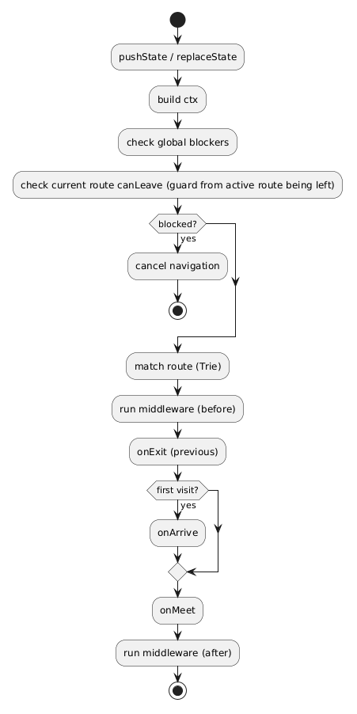
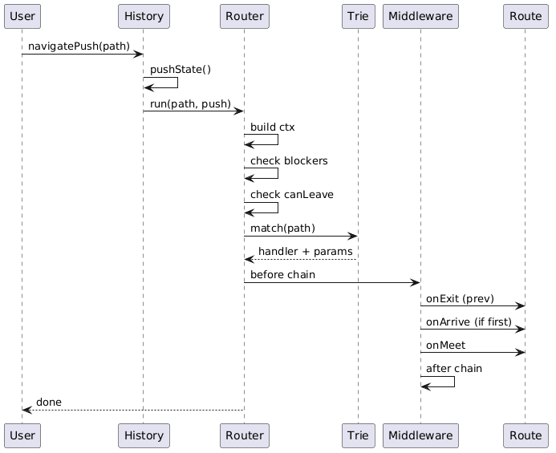
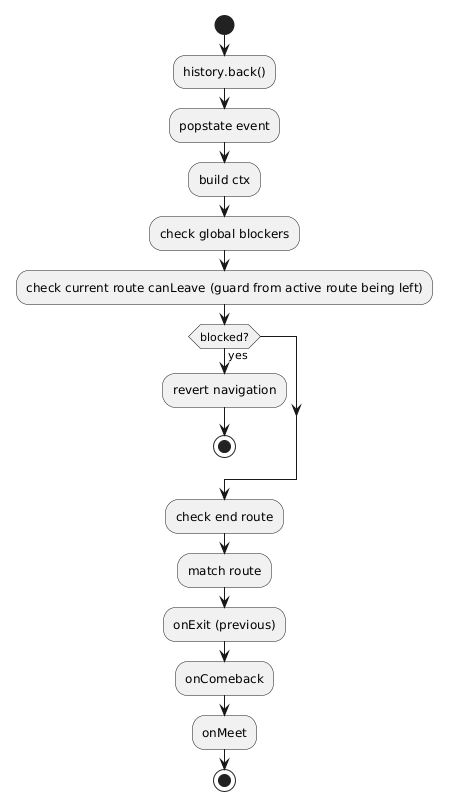
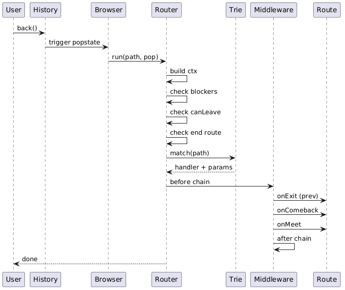

# History Router (SPA Navigation Engine)

A lightweight, UI-agnostic navigation engine built on top of the native History API. This design extends the `window.history` object to provide structured routing, lifecycle control, and navigation orchestration without introducing external dependencies.

---

## Overview

This system enhances the native browser navigation model while preserving its behavior:

* No page reloads
* Native back/forward support
* URL-driven state
* History stack integrity

The router acts purely as an orchestration layer and does not handle rendering.

---

## Getting Started

### Run Local Server

This project includes a simple Node.js static server for running examples.

```bash
node server.js
```

Then open in your browser:

```text
http://localhost:5173
```

---

### Why a Server is Required

When using **history mode**, the browser relies on the History API (`pushState`, `replaceState`).

Opening files directly using:

```text
file://...
```

will break routing behavior.

---

### Alternative (No Server)

If you cannot run a server, switch to hash mode:

```js
history.config({
  mode: "hash"
});
```

---

## Examples

Available examples:

* `/examples/01-basic-routing`
* `/examples/07-bottom-sheet`

More examples are included as scaffolding and will be expanded.

---

## Routing Mode

This system supports two routing modes:

### History Mode (default)

```
/about
```

Uses the native History API (`pushState`, `replaceState`, `popstate`).

Requirements:

Depends on application architecture:

* Single-entry (SPA): server should return a single HTML entry (e.g. `index.html`)
* Multi-entry / SSR: each route can return its own HTML document

Direct access or reload on nested routes must be handled accordingly by the server.

---

### Hash Mode

```
/#/about
```

Uses the URL hash (`location.hash`, `hashchange`) and does not require server configuration.

Works in:

* static hosting
* local files (`file://`)
* environments without server fallback

---

### Configuration

```js
history.config({
  mode: "history" // or "hash"
});
```

---

### Behavior

Navigation paths are normalized and resolved through the internal path layer.

| Method                    | History Mode    | Hash Mode         |
| ------------------------- | --------------- | ----------------- |
| navigatePush("/about")    | base + "/about" | /#/about          |
| navigateReplace("/about") | base + "/about" | /#/about          |
| navigatePop()             | uses `popstate` | uses `hashchange` |

Example (with base = "/app"):

```
navigatePush("/about") → /app/about
```

Notes:

* In history mode, `base` is automatically prefixed if configured
* In hash mode, paths are converted to `/#/path`
* Query strings are preserved (e.g. `/about?tab=1`)

---

## Path Resolution

The router uses a centralized path handling layer that ensures consistent behavior across modes.

Internally, the following steps are applied:

1. Normalize path (ensure leading `/`, remove invalid prefixes)
2. Apply or strip `base` depending on direction
3. Extract query parameters into `ctx.query`
4. Match normalized path against registered routes

Mode-specific behavior:

* History mode → uses `location.pathname + location.search`
* Hash mode → uses `location.hash` (without `#`)

Example:

```
URL: /examples/01-basic-routing/about?tab=1

Resolved:
path  = /about
query = { tab: "1" }
```

---

## Recommendation

* Use history mode when server configuration is available
* Use hash mode for static or file-based environments

---

## Base Path

In multi-entry or nested environments (e.g. running applications under subdirectories like `/examples/...`), the router can be configured with a base path.

### Configuration

```js
history.config({
  base: "/examples/01-basic-routing"
});
```

### Behavior

The base path is:

* Prefixed to all navigation URLs
* Stripped before route matching

Example:

```
URL:        /examples/01-basic-routing/about
Base:       /examples/01-basic-routing
Route path: /about
```

### Use Cases

* Running multiple router instances under different paths
* Serving examples from subdirectories
* Embedding applications inside larger sites

---

## Path Handling Principles

The router is built around a centralized path abstraction layer.

Key principles:

* Paths are always normalized (must start with `/`)
* Base path is transparent to route definitions
* Query strings are preserved and exposed via `ctx.query`
* Supports both history and hash modes consistently
* Accepts both relative and absolute input paths

---

## Core API

```js
history.router(path, handler?)
history.navigatePush(path, state?)
history.navigateReplace(path, state?)
history.navigatePop()

history.use(middleware)
history.block(blocker)
history.notFound(handler)
```

---

## Navigation Methods

All navigation methods are built on top of the native History API and do not trigger page reloads.

### navigatePush

```js
history.navigatePush("/about", { from: "home" });
```

* Uses `pushState`
* Adds a new history entry
* Updates URL
* Triggers router execution

---

### navigateReplace

```js
history.navigateReplace("/login");
```

* Uses `replaceState`
* Replaces current history entry
* Updates URL
* Triggers router execution

---

### navigatePop

```js
history.navigatePop();
```

* Uses `history.back()`
* Relies on `popstate` event
* Router execution is triggered by the event

---

## Route Definition

### Function Style

```js
history.router("/about", (ctx) => {
  console.log("About page");
});
```

Internally mapped to:

```js
{ onMeet: handler }
```

---

### Object Style

```js
history.router("/user/:id", {
  onMeet(ctx) {},
  onArrive(ctx) {},
  onExit(ctx) {},
  onComeback(ctx) {},
  canLeave(ctx) { return true; },
  end: true
});
```

---

### Chaining Style

```js
history
  .router("/user/:id")
  .onMeet(ctx => {})
  .onExit(ctx => {})
  .canLeave(ctx => true)
  .end(true)
  .done();
```

All styles are normalized into a lifecycle object internally.

---

## Lifecycle Hooks

| Hook       | Description                             |
| ---------- | --------------------------------------- |
| onMeet     | Runs every time route becomes active    |
| onArrive   | Runs only on first entry                |
| onExit     | Runs before leaving the route           |
| onComeback | Runs when returning via back navigation |

All hooks default to no-op if not defined.

---

## Context Object (ctx)

```js
{
  path,    // normalized path (without base)
  params,  // dynamic route params
  query,   // parsed query object
  state,
  from,
  to,
  type     // push | replace | pop
}
```

### Query Example

```js
history.navigatePush("/about?tab=1");

history.router("/about", (ctx) => {
  console.log(ctx.query.tab); // "1"
});
```

---

### Dynamic Parameters

```js
history.router("/article/:id", (ctx) => {
  console.log(ctx.params.id);
});

history.navigatePush("/article/9");
```

Result:

```js
ctx.params = { id: "9" };
```

Notes:

* Parameters are strings
* Static routes take priority over dynamic

---

## Middleware

```js
history.use(async (ctx, next) => {
  await next();
});
```

Execution order:

1. Middleware (before)
2. Lifecycle
3. Middleware (after)

---

## Guards and Blocking

### Understanding `canLeave`

`canLeave` is evaluated on the **current (active) route**, not the target route.

It answers the question:

```
Is the current route allowed to be exited?
```

This check is performed for every navigation attempt:

* navigatePush
* navigateReplace
* browser back/forward (popstate)

Flow perspective:

```
[current route] --(canLeave?)--> [next route]
```

If `canLeave` returns `false`, navigation is cancelled before any lifecycle of the next route runs.

Relation to lifecycle:

* `canLeave` → decision (guard)
* `onExit` → side effect (executed after allowed)

---

### Global Blocker

```js
history.block(() => false);
```

### Route-level Guard

```js
history.router("/form", {
  canLeave() {
    return false;
  }
});
```

---

## End Route

```js
history.router("/success", {
  end: true
});
```

Defines a terminal route in navigation flow.

---

## Execution Flow

### Programmatic Navigation (Activity Diagram)



---

### Programmatic Navigation (Sequence Diagram)



---

### Back Navigation (Activity Diagram)



---

### Back Navigation (Sequence Diagram)



---

## Production Considerations

### Link Interception

```js
document.addEventListener("click", (e) => {
  const a = e.target.closest("a[data-link]");
  if (!a) return;

  const url = new URL(a.href);

  if (url.origin !== location.origin) return;

  e.preventDefault();

  history.navigatePush(url.pathname + url.search);
});
```

---

### Server Handling

Server behavior depends on the application architecture:

#### Single-entry (SPA)

All routes should resolve to a single HTML entry file:

```
/about → index.html
```

Requires server-side fallback configuration.

---

#### Multi-entry / SSR

Each route may return its own HTML document:

```
/       → index.html
/about  → about.html
```

The router acts as a client-side orchestration layer on top of server-rendered content.

---

### State Handling

If `state` is not provided:

```js
history.state === null
```

It is recommended to normalize it to an empty object in the router implementation.

---

## Design Principles

1. Router acts as orchestration layer
2. No dependency on UI or rendering
3. Lifecycle-driven navigation
4. Native browser behavior is preserved
5. Extends History API semantics rather than replacing them

---

## License

MIT
